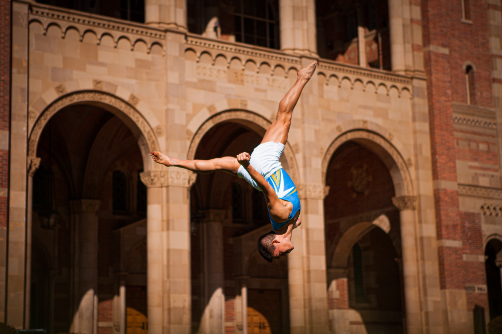
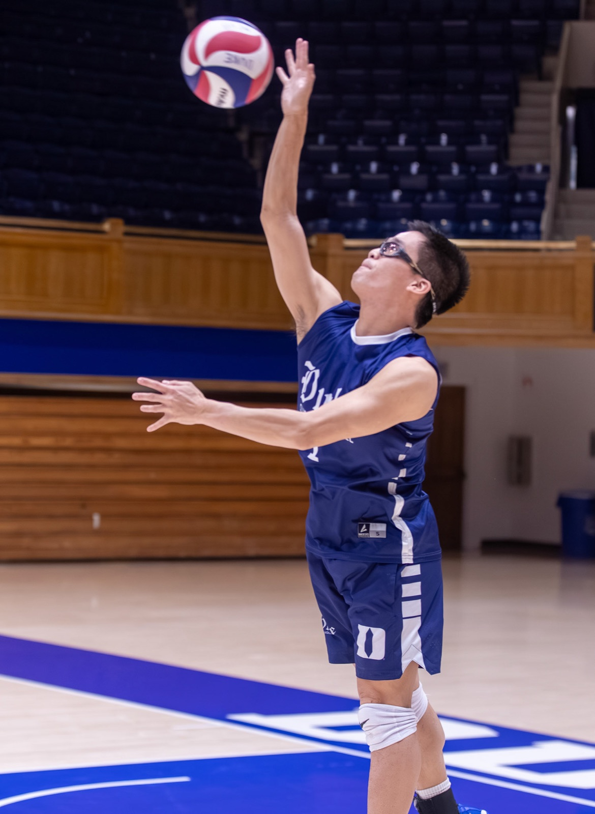
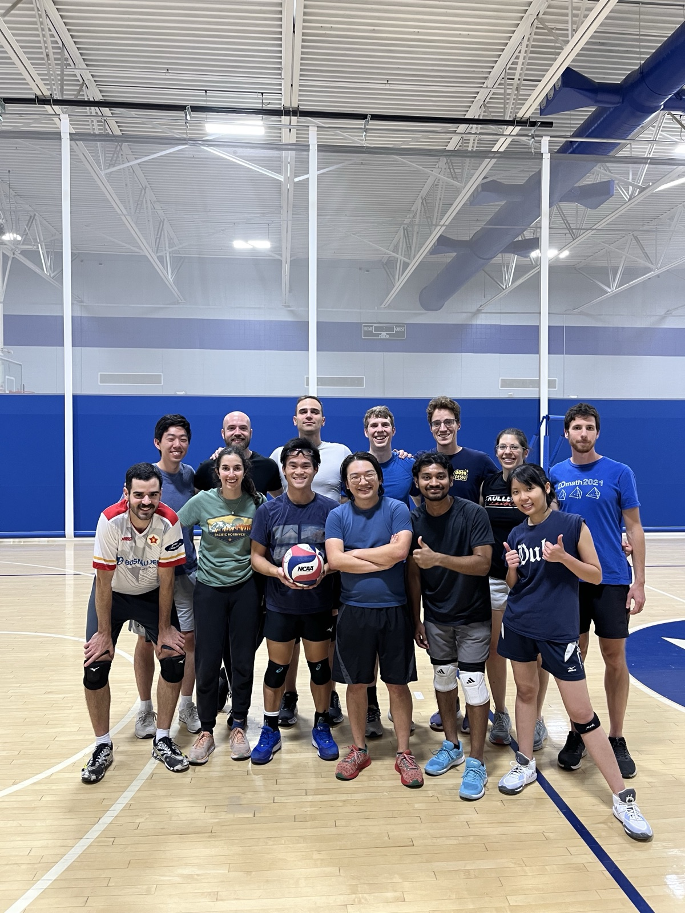
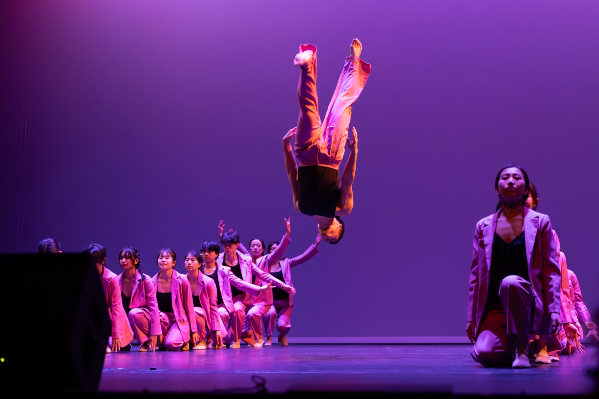
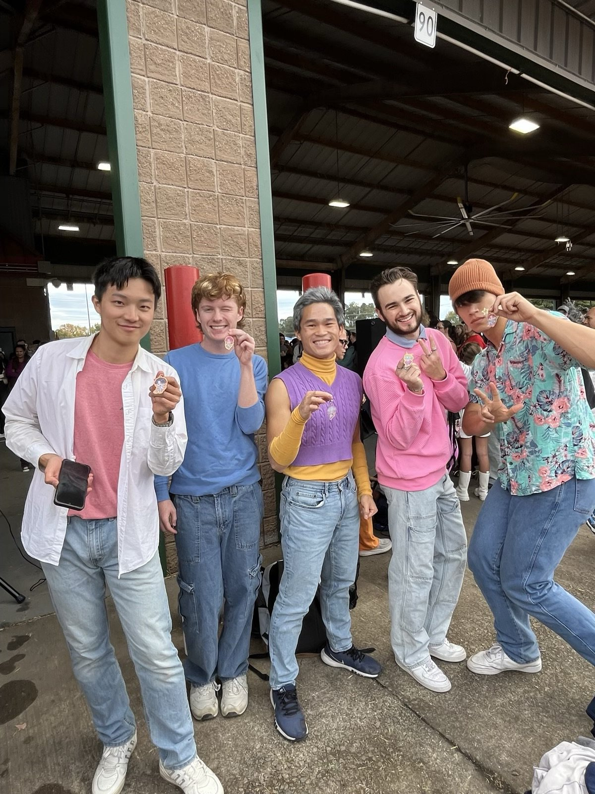

The parts that don't fit on a CV.

## Gymnastics

I'm a competitive gymnast and an equally committed fan of the sport. At UCLA I
[served as president](https://uclaclubsports.com/sports/gymnastics/roster/joshua-lim/14062)
of the club team from 2022 to 2024, and in my final season competing we won the
school's first team national title. When I arrived at Duke I helped
[found a club team here](https://dukechronicle.com/article/duke-club-gymnastics-new-club-peralta-ayodele-josh-lim-ucla-the-den-jordan-chiles-naigc-triangle-collaboration-unity-facility-20250422),
and I still train and compete.

My fandom for UCLA gymnastics got sufficiently out of hand that
[the LA Times wrote about it](https://www.latimes.com/sports/ucla/story/2023-03-28/ucla-gymnastics-super-fan).
I still venture back regularly to watch the floor parties in Pauley Pavilion.

::: {.photo-wide}
<figure>
  
  <figcaption>Royce Hall, UCLA.</figcaption>
</figure>
:::

## Volleyball

I travel and compete with Duke Men's Club Volleyball, and I volunteer as an
assistant coach for the boys' varsity team at the North Carolina School of
Science and Mathematics. At UCLA I was a ball boy for the men's team.

I also captain the Duke Statistical Science intramural team, the Spike and
Slabs.

::: {.gallery}
<figure class="tall">
  
  <figcaption>Duke Men's Club Volleyball.</figcaption>
</figure>

<figure class="tall">
  
  <figcaption>The Spike and Slabs. The name works in both directions.</figcaption>
</figure>
:::

## Dance

I perform and choreograph for Duke Chinese Dance, and I'm part of the NC Saja
Boys. Away from the stage, I've choreographed dozens of gymnastics floor
routines at every level, from Xcel Platinum through Division I.

### Duke Chinese Dance

::: {.photo-wide}
<figure>
  
  <figcaption>Duke Chinese Dance.</figcaption>
</figure>
:::

::: {.video-embed}
<iframe src="https://www.youtube.com/embed/jqlTxLxB0-o?start=108"
        title="Duke Chinese Dance performance"
        loading="lazy"
        allow="accelerometer; autoplay; clipboard-write; encrypted-media; gyroscope; picture-in-picture; web-share"
        allowfullscreen></iframe>
:::

::: {.video-caption}
Duke Chinese Dance. Starts at the section I'm in.
:::

### NC Saja Boys

::: {.photo-portrait}
<figure>
  
  <figcaption>NC Saja Boys.</figcaption>
</figure>
:::

::: {.video-embed}
<iframe src="https://www.youtube.com/embed/TI7jlBo19jM?start=118"
        title="NC Saja Boys performance"
        loading="lazy"
        allow="accelerometer; autoplay; clipboard-write; encrypted-media; gyroscope; picture-in-picture; web-share"
        allowfullscreen></iframe>
:::

::: {.video-caption}
NC Saja Boys.
:::

## Teaching things I'm not paid to teach

In 2021 I built a free asynchronous multivariable calculus course — 22 lectures,
homework, quizzes, two midterms, three projects, and a final — because the
students who most needed a head start were the least likely to be able to pay
for one. Ten people took it that first summer, and new students still work
through the material every year.
